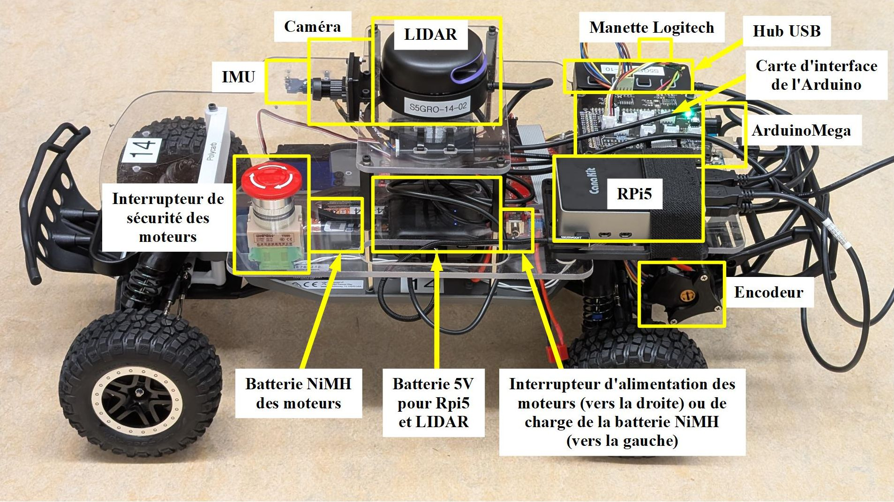
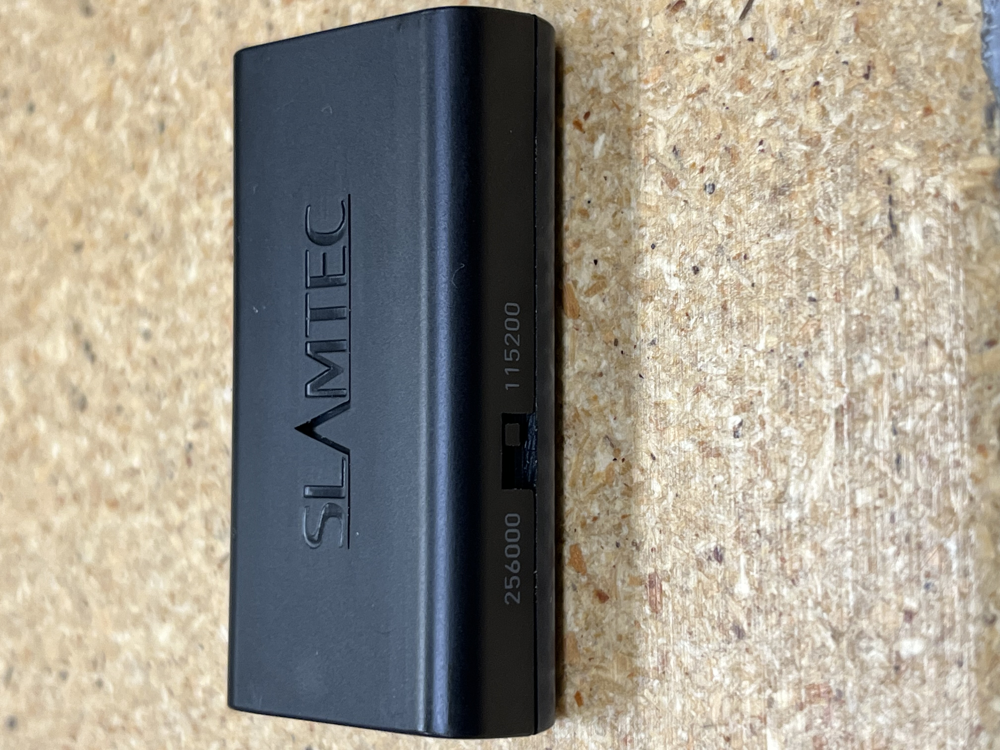

* [Hardware Connections](#hardware-connections)
* [USB Hub woes](#usb-hub-woes)
* [Steering Offset](#steering-offset)
* [Remote Connection (SSH/XRDP)](#remote-connection-sshxrdp)
* [The RaceCar batteries](#the-racecar-batteries)
* [Charging the Anker battery](#charging-the-anker-battery)
* [Charging the Traxxas battery](#charging-the-traxxas-battery)
* [The Killswitch](#the-killswitch)
* [The Lidar Configuration](#the-lidar-configuration)
  

# Hardware Connections

  

**WARNING**: Make sure the Raspberry Pi5 is unpowered when you connect and disconnect cables. Also make sure you **shutdown properly** the Pi5 (`sudo halt` in a terminal or doing a shutdown in the interface) before unplugging the power. Otherwise **it may corrupt/damage your SD-CARD!**

First, get some metric Allen Keys so you can mount your ArduinoMega and your Raspberry Pi5.

* Connect the ArduinoMega under the black PCB. Its USB port must face toward the back of the RaceCar. If you have a transparent base under your Mega, remove it first! It will only get in the way.

   * Connect the grey flat cable in J1 "Controles".
   * Connect the IMU in J4 "I2C".
   * Connect the propulsion encoder in J2 "EncProp".

* Mount your Rapberry Pi5 on its craddle. Secure it with the elastic band. Its USB ports must face toward the back of the RaceCar.

* Connect the camera (#6) in a USB port of the Pi5.

* Connect the Logitech Controller's USB dongle (#7) into the USB hub (#10).
* Connect the USB hub (#10) into one USB-A port of the Pi5.
* USB cable #12: Connect into ArduinoMega USB-B and Pi5 USB-A.
* USB cable #16: Connect into LIDAR (#2) round connector and USB Power Pack (#5) USB-A.

Finally, **CONNECT ONLY WHEN READY TO POWER UP YOUR Raspberry Pi**:

* USB cable #13: Connect into USB Power Pack (#5) USB-A and Pi5 USB-C.

And once the PI is booted:

* USB cable #14: Connect into Pi5 USB3 and LIDAR (#2) Micro-USB.

# USB hub woes
If the USB hub doesn't seem to work or is not recognized, try the following first before calling it defective:

1. Some of you will be shocked to learn that quality control on the Raspberry Pi assembly line is not very stringent. Way too many brand new Raspberry Pi are shipped with defective micro SD cards, some even have non-functional USB ports. So, first test the USB ports of your Pi by connecting something else directly on them, for example a USB mouse or a USB keyboard. And make them work.

2. You can see four pushbuttons on the hub, one for each USB port. These power on/off each port. Unless the button is lighted up in blue (the yellow arrow below points to one), the associated USB port is disabled.

    
    <p align="center"><i>In this picture, the USB port on the right is the only one enabled</i></p>

# Steering Offset
If the RaceCar doesn't move straight when no steering commands are sent, it is possible to adjust the steering mechanically and by software. If the steering offset is small, you may skip the mechanical calibration and just [adjust in software](#sofware-calibration).

## Mechanical calibration
**Note**: Mechanical calibration has already been done. Normally you only need to perform [software calibration](#sofware-calibration).

1. Make sure the Arduino is flashed with the default firmware: [`main.cpp`](../racecar_arduino/Controller/src/main.cpp). (See flash procedure in the Launch section here: [`README`](../README.md)). When the RaceCar's power board is activated, the arduino will send a zero steering value.
2. Unscrew that screw:

    

3. Adjust the screw indicated by a green circle to make the piece indicated by a red circle be straight:

    

4. Screw back this screw:

    

5. Adjust this screw (called "Toe" suspension adjustment) to make each wheel straight between each other:

    

## Sofware calibration

Adjust this steering offset [here](../racecar_autopilot/racecar_autopilot/slash_controller.py#L28).

# Remote Connection (SSH/XRDP)

First, make sure the ethernet and hotspot interfaces are properly configured on your Raspberry Pi (see Step 5 of [this section](../images/README.md#restore-raspberrypi-image)). The default login is `racecar` with password `racecar`.

 * SSH (command line):
     ```bash
     # By ethernet:
     $ ssh racecar@192.168.10.1

    # By Hotspot
    $ ssh racecar@10.42.0.1
    ```
 * [VScode remote ssh](https://code.visualstudio.com/docs/remote/ssh) :

    VScode remote ssh extension allows you to open a remote folder on any remote machine, virtual machine, or container with a running SSH server and take full advantage of VS Code's feature set. This lets you modify the files directly in the RaspberryPi on the VScode application from your computer.


 * XRDP (Remote Desktop Connection)
   You can use the default windows remote desktop connection app. Also, ensure that no monitor is connected to the Raspberry Pi during boot and you are not logged in, otherwise it wont work.
   * By ethernet: set IP to `192.168.10.1`
   * By Hotspot: set IP to `10.42.0.1`
    
# The RaceCar batteries

* The RaceCar contains two batteries:
    * a 5V Anker battery to power the Raspberry Pi and the LiDAR;
    * a 8.4V Traxxas Ni-Mh battery to power the motors.

# Charging the Anker battery

* To charge the Anker battery, use the small USB connector, plug it in the "input" port, then connect the other side to a computer's powered USB or a phone charger 5V. If the battery is empty, it can take many hours to charge (maybe charge during the night), but it should last long.

    

# Charging the Traxxas battery

* For the Traxxas battery, use the charger coming with the Kit (it may differ from the figure below depending on the version). Make sure the switch of the motor drive is on left ("Charge"). Connect the wires like in the figure below. **To avoid a short circuit, make sure to connect the "banana" plugs first in the charger before plugging the other end to the power board (do the reverse when removing the wires after charging!)**. On the charger, make sure to choose **"NiMH Charge"** and the maximum current limit is 2A. Hold « Start » to start charging. When the battery is charged, the charger should stop by itself with a sound. Stop charging manually if it has been charging for more than 2 hours. Normally, the charger is set to cutoff after 2 hours of charging.

    .jpg)

* Sometimes, the charger will "charge" the Traxxas battery for like 20 seconds and then decide it is full. In reality, the battery has not been recharged. Wait a minute and try again (Hold Start). Repeat until the charging cycle starts for real (at least 25 minutes or more);
* If it still doesn't want to charge, you must perform a Discharge/Charge cycle. Set the Discharge rate at 100mA and the Charge rate at the usual 2A.

```
If the charger is not already in NiMH Mode:
- Press "Stop" and then "Inc" until you get "NiMH Batt"

To set the charger into Discharge -> Charge Mode:

- Press "Start"
- If the Current is other than 2.0A, press "Start" once and adjust value with "Dec." and "Inc.", then press "Start" once to confirm
- Press "Inc." until you find "NiMH Discharge"
- Press "Start" to adjust values: 0.1A and 1.4V
- Press "Inc." Until you find "NiMH Cycle"
- Press "Start" to adjust cycle to "DCHG>CHG" (discharge, then charge)
- Hold "Start" until the charger commences the cycle.
```
* The Charger user manual can be found [here](SkyRC_iMAX_B6AC_V2_V3.10.pdf).

# The Killswitch

* The RaceCar features a big red mushroom: the killswitch. When pressed, the motor drive is disabled and the car stops moving. This is a hardware killswitch connected directly to the motor drive. It will disable propulsion regardless of software. The killswitch is a "normally close" switch. When you press it, the circuit open;
* When the RaceCar moves around, you have to run after it if you want to make an emergency stop. Make yourself a remote killswitch when you are ready to test drive. The switch is connected into a detacheable header on the motor drive. The simplest remote killswitch is a long loop of wire that you hold in your hand. Should the RaceCar go too far away from you, the detachable header will pop out of its socket (as long as you hold firmly your end), opening the circuit:

    

    

    <p align="center"><i>The simplest remote killswitch: a long loop of wire</i></p>

* Alternatively you can dismount the red mushroom from the RaceCar and lenghten its wires so you can hold it in your hand during live tests instead of the simple wire loop.

# The LiDAR configuration
* For the LiDAR, you'll need to set the serial baud rate in the bringup launch file according to your specific model. There are two variants: the A2M8 (red) and the A2M12 (purple), as illustrated in the image below:

| A2M8 | A2M12 |
|-----------|----------------|
|  |  |


* For the A2M8, the serial baud rate is 115 200 bit/s
* For the A2M12, the serial baud rate is 256 000 bit/s

* In this file : [`bringup.launch.py`](../racecar_bringup/launch/bringup.launch.py) , you'll find the LiDAR node declaration, which includes a serial_baudrate parameter. Ensure that its value matches the specifications of your LiDAR model.

* Ensure that the Slamtec UART-to-USB serial port adapter board switch is set to the correct baud rate, as shown in the image below:


